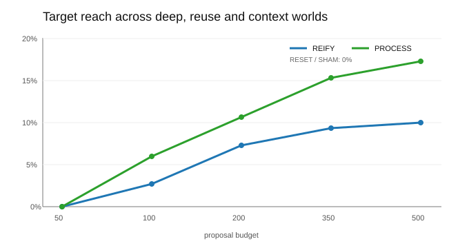
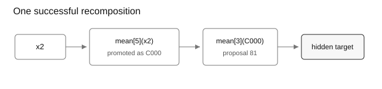

# concept-recomposition

Can saving a useful intermediate result make a search reach expressions it otherwise cannot build?

The search starts with five raw variables, `x1..x5`. Each proposal may add one operation: a lag, difference, rolling mean/std, rank/sign/abs, arithmetic operation, min/max or conditional.

That makes reachability easy to see. A fixed search can propose:

```text
mean[5](x2)
```

but not this two-step target in one proposal:

```text
mean[3](mean[5](x2))
```

A recomposing search can save `mean[5](x2)` as `C001`, then later propose `mean[3](C001)`.

## Experiment

Four searches get the same 500-proposal budget.

- **RESET** always searches from the original variables.
- **REIFY** may save one good expression per generation as a reusable terminal.
- **SHAM** gets the same number and approximate size of new terminals as REIFY, but saves low-scoring expressions.
- **PROCESS** is REIFY plus a small bias towards operators that appeared in previously saved expressions.

An expression is saved only if it clears the same threshold on two separate development slices. The final held-out slice is never used for promotion.

There are five synthetic problems:

| world | what has to happen |
|---|---|
| shallow | find a one-step target |
| deep | save an intermediate, then use it to build a two-step target |
| reuse | use the same intermediate to reach two different targets |
| context | use an intermediate inside a conditional expression |
| decoy | there is no hidden target |

Each result below is over 50 deterministic seeds.



At 500 proposals:

| world | RESET | SHAM | REIFY | PROCESS |
|---|---:|---:|---:|---:|
| shallow | **84%** | 44% | 44% | 44% |
| deep | 0% | 0% | 12% | **28%** |
| reuse | 0% | 0% | 2% | **6%** |
| context | 0% | 0% | 16% | **18%** |

Reification changes what is reachable: RESET and SHAM never solve the three problems that require useful composition.

It also costs search budget. On the shallow problem, where nothing needs to be saved, RESET wins easily.

The hard part is not just finding the right building block. In the deep world, REIFY saves the correct intermediate in 44% of runs but finishes the target in 12%; PROCESS does so in 50% and finishes in 28%. In the reuse world, both save the shared intermediate in 42% of runs, but only 2% and 6% respectively reach both downstream targets.

The decoy also matters. REIFY promotes 0.54 expressions per run on average and PROCESS 0.50: low, but not zero.

## One run



In seed 20 of the deep world, `mean[5](x2)` is saved as `C001`. Proposal 121 then tries `mean[3](C001)`, which expands exactly to the hidden target.

PROCESS has the higher hit rate in this small benchmark, but it does not consistently find successful targets sooner. It is a simple proposal bias, not evidence of self-improving search.

## Old-market check

The same machinery is run on stale daily data for SPY, QQQ, TLT, GLD and EEM from 2008–2019. This is not an alpha test; it asks whether saved expressions change the kind of structures the search reaches.

| search | confirmed + held-out-positive expressions | max depth | reused concepts | best held-out corr. |
|---|---:|---:|---:|---:|
| RESET | 10.5 | 2.0 | 0.0 | **0.1004** |
| REIFY | **75.9** | 9.3 | **8.8** | 0.0977 |
| SHAM | 5.6 | 3.8 | 6.4 | 0.0968 |
| PROCESS | 51.3 | 7.6 | 8.3 | 0.0965 |

Recomposition produces deeper, reused structures. It does **not** improve the best held-out predictive correlation in this exercise.

## Run

```bash
python -m pip install -e ".[dev]"
python -m concept_recomposition.reproduce
```

Add `--market` to rerun the stale-market check. The public price snapshot is pinned and hash-checked before use.

Compact outputs are in `results/`. Python 3.11+. Apache-2.0.
