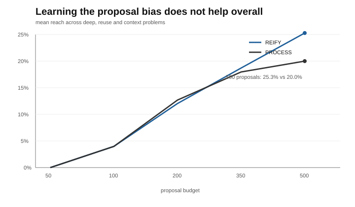

# concept-recomposition

Can a search reach ideas it could not build before by saving useful intermediate results and reusing them as new building blocks?

Each proposal is allowed **one local operation**. The search starts with five raw variables, `x1..x5`.

So it can propose:

```text
mean[5](x2)
```

but RESET cannot propose this in one step:

```text
mean[3](mean[5](x2))
```

REIFY can save the first expression as `C001`, then `mean[3](C001)` is a legal two-node proposal even though it expands to the three-node target.

## The comparison

Four searches get the same 500 proposal attempts.

- **RESET** — vocabulary never changes.
- **REIFY** — confirmed, non-redundant expressions can become new atomic operands.
- **SHAM** — gets the same number of extra operands, with similar size, but from poor expressions.
- **PROCESS** — REIFY plus a small proposal bias learned only when a saved concept is later reused successfully.

Promotion uses two development slices. The final held-out slice is not used to decide what gets saved. For evaluation, affine-equivalent expressions count as the same hidden mechanism.

Five synthetic problems test different cases:

| problem | what the search has to do |
|---|---|
| shallow | find a one-step target |
| deep | save an intermediate, then build on it |
| reuse | use one saved intermediate in two different targets |
| context | use a saved intermediate inside a conditional |
| decoy | avoid inventing structure where none exists |

Each result is over 50 deterministic seeds.


At 500 proposals:

| problem | RESET | SHAM | REIFY | PROCESS |
|---|---:|---:|---:|---:|
| shallow | **80%** | 48% | 56% | 68% |
| deep | 0% | 0% | **46%** | 28% |
| reuse | 0% | 0% | 6% | **14%** |
| context | 0% | 4% | **12%** | 8% |

The important comparison is not REIFY versus RESET alone. SHAM gets the same structural privilege and still reaches almost none of the recursive targets.

REIFY also has a cost. On the shallow problem, where nothing needs to be saved, RESET is better.

PROCESS is not an upgrade here. It beats REIFY on the reuse problem, but loses on deep and context; pooled final reach is 16.7% versus 21.3% for REIFY.

## One successful run


In seed 0 of the deep problem:

```text
mean[5](x2)          -> saved as C000
mean[3](C000)        -> local size 2
mean[3](mean[5](x2)) -> expanded size 3; hidden target
```

The target appears at proposal 249. RESET never gets the inner expression as an atomic operand, so that composition is outside its one-step proposal set.

The archive stays small: REIFY saves about 3.3 concepts per run in the deep problem and 0.12 in the decoy problem.



## Old-market check

The same search machinery is run on stale daily data for SPY, QQQ, TLT, GLD and EEM from 2008–2019. The question is only whether recomposition changes the structures reached, not whether it finds alpha.

| search | stable expressions | max depth | reused concepts | best held-out corr. |
|---|---:|---:|---:|---:|
| RESET | 9.7 | 2.0 | 0.0 | **0.1004** |
| REIFY | 39.0 | 3.7 | 2.0 | 0.0917 |
| SHAM | 8.9 | 3.1 | 2.0 | 0.0974 |
| PROCESS | **39.1** | **3.8** | **2.1** | 0.0977 |

Recomposition reaches more and deeper stable expressions. It does not improve the best held-out correlation.

## Public scope

This is a public research benchmark, not an alpha claim. The market appendix uses deliberately stale, generic data and is included only to test whether recomposition changes the structures reached.

Related: [selector-limitation](https://github.com/GOTH0S/selector-limitation), a separate experiment on selection regret as hypothesis search expands.

## Run

```bash
python -m pip install -e ".[dev]"
python -m concept_recomposition.reproduce
```

Add `--market` to rerun the stale-market check. The price snapshot is pinned and hash-checked before use.

Python 3.11+. Apache-2.0.
